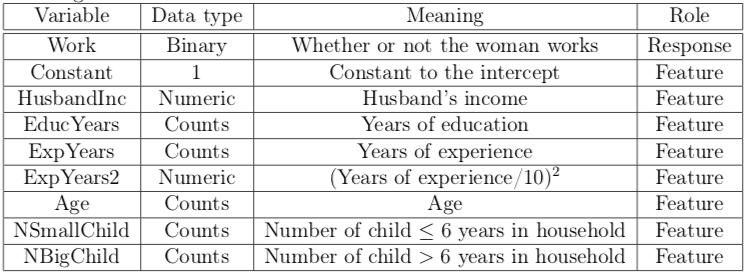

```{r setup, include=FALSE}
knitr::opts_chunk$set(echo = TRUE, out.width = "400px")
```

\newpage

```{r, echo=FALSE, message=FALSE}
# packages we use in the lab
library(mvtnorm)
library(LaplacesDemon)
library(ggplot2)
library(reshape2)
library(gridExtra)
```

```{r, echo=FALSE, warning=FALSE}
# clean environment
rm(list=ls())
```


# 1. Linear and polynomial regression
The dataset *TempLinkoping.txt* contains daily temperatures (in Celcius degrees) at $Malmsl \"a tt$, Link$\"o$ping over the course of the year 2016 (366 days since 2016 was a leap year). The response variable is temp and the covariate is

$$ \ time = \frac{\ the \ number \ of \ days \ since \ beginning \ of \ year}{366}  $$
The task is to perform a Bayesian analysis of a quadratic regression

$$ \ temp = \beta_0 + \beta_1 \cdot \ time + \beta_2 \cdot \ time^2 + \varepsilon \overset{\text{iid}}{\sim} \mathcal{N}(0,\sigma^2)$$

## (a) Determining the prior distribution of the model parameters. 
Use the conjugate prior for the linear regression model. Your task is to set the prior hyperparameters $\mu_0, \Omega_0, \upsilon_0$ and $\sigma^2_0 = 1$ to sensible values. Start with $\mu_0 = -10, 100, -100)^T$ ,$\Omega_0 =0.01 \cdot I_3,  \upsilon_0 = 4, \sigma^2_0 = 1$. Check if this prior agrees with your prior opinions by simulating draws from the joint prior of all parameters and for every draw compute the regression curve. This gives a collection of regression curves, one for each draw from the prior. Do the collection of curves look reasonable? If not, change the prior hyperparameters until the collection of prior regression curves do agree with your prior beliefs about the regression curve. [Hint: the R package *mvtnorm* will be handy. And use your $Inv - \chi^2$
simulator from Lab 1.]


```{r, echo=FALSE}
# load the data
tempdata <- read.table("TempLinkoping.txt",header = TRUE, sep = "\t")
y        <- tempdata$temp
# lecture 5 slide 5 -  The linear regression model in matrix form 
# X - matrix represents the model 
X        <- cbind(1, tempdata$time, tempdata$time**2) 
n        <- nrow(X)
```

From the text task can be given values for prior parameters.
```{r}
# given parameter values
mu_0     <- c(-10, 100, -100)
omega_0  <- 0.01 * diag(3)
v_0      <- 4
sigma2_0 <- 1
```


The linear regression:
```{r}
# linear model - without beta
lmTemp = lm( temp ~ time + I(time^2), data = tempdata)
```

```{r, echo=FALSE}
summary(lmTemp)
```


```{r, echo=FALSE}
# plot the data
ggplot(tempdata, aes(x = time, y=temp)) +
  geom_point(aes(color = "#e74c3c")) +                         # default blue
  ylab("Temperature") + xlab("Time") + ggtitle("Time vs Temperature") +
  scale_color_identity(name = "colour",
                          breaks = c("#e74c3c"),
                          labels = c("Observations"),
                          guide = "legend") + 
  theme(legend.position = "bottom")
```


Linear regression - conjugate prior
Posterior - simulate $\sigma^2$ & $\beta$:

```{r}
# create simulation
set.seed(123456)

# joint conjugate prior
N <- 40  # nr of simulations

# data frame to save prior coef data
prior <- matrix(ncol = 3, nrow = N)
for (i in 1:N) {
  
  # lecture 5 slide 7 - Inv - chi^2(v_0,sigma^2_0)
  var  <- LaplacesDemon::rinvchisq(1 ,v_0, sigma2_0)
  
  # solve(A)	Inverse of A where A is a square matrix
  beta <- MASS::mvrnorm(1, mu_0, var*solve(omega_0))
  
  prior[i,1:3] <- beta
}

```

```{r echo=FALSE}
data.1a <- as.data.frame(cbind(tempdata$time, X%*%t(prior))) 

cnames <- c("x")
for (i in 1:N) {
  cnames[1+i] <- paste0("pred.",i)
}
colnames(data.1a) <- cnames
data.1a <- melt(data.1a, id.vars = "x") # data.1a - variable to create a color for each line

plot1a.ori <- ggplot(data.1a)+
  geom_line(aes(x = x, y = value, color = variable)) +
  geom_point(data = tempdata, aes(x = time, y = temp), colour = "#e74c3c") +
  ggtitle("Original parameters") + ylab("Temperature") + xlab("Time") +
  theme(legend.position = "none") 
```


Adjusted/Modified parameter values:
```{r}
# modify the parameters
mu_0     <- c(-10.68, 93.60, -85.83)  # before c(-10, 100, -100), 
# change into values given in the lm output
omega_0  <- 0.01 * diag(3)
v_0      <- 4
sigma2_0 <- 0.02              # before 1 - change 

```

\newpage

Regression curves by simulating draws from the joint prior of all parameters. 
The number of draws is 40. 

It can be observed that some simulation at the given parameters an absolutely unrealistic temperature, some go from -50 to -150. 

The exercise was to adjust the given values for the parameters to make a better prediction of the temperature. 
So we decided to the $\mu_0$ values to the coefficients we received by running the linear regression in an earlier stage of the lab.  
We also changed the $\sigma^2_o$ value, because we observed quied big differenced in the first simulation, which we want to get ridge of. 
After testing did we adjust $\sigma^2_o$ to 0.02. 
The rest of the parameters we didn´t change.


```{r echo=FALSE}

# -------------------------- same code as before - maybe create a function
prior <- matrix(ncol = 3, nrow = N)
for (i in 1:N) {
  var  <- LaplacesDemon::rinvchisq(1 ,v_0, sigma2_0)
  beta <- MASS::mvrnorm(1, mu_0, var*solve(omega_0))
  prior[i,1:3] <- beta
}

# Linear regression in matrix form - X%*%t(prior)
# lecture 5 slide 5
data.1a <- as.data.frame(cbind(tempdata$time, X %*% t(prior)))


cnames <- c("x")
for (i in 1:N) {
  cnames[1+i] <- paste0("pred.",i)
}
colnames(data.1a) <- cnames
data.1a <- melt(data.1a, id.vars = "x")

plot1a.mdf <- ggplot(data.1a)+
  geom_line(aes(x = x, y = value, color = variable)) +
  geom_point(data = tempdata, aes(x = time, y = temp), color = "#e74c3c") +
  ggtitle("Modified parameter") + ylab("Temperature") + xlab("Time") +
  theme(legend.position = "none")

plot(arrangeGrob(plot1a.ori, plot1a.mdf, nrow = 2))
```


## (b) Write a program that simulates from the joint posterior distribution 
of $\beta_0, \beta_1, \beta_2$ and $\sigma^2$. Plot the marginal posteriors for each parameter as a histogram. Also produce another figure with a scatter plot of the temperature data and overlay a curve for the posterior median of the regression function $f(\ time) = \beta_0 + \beta_1 \cdot \ time + \beta_2 \cdot \ time^2$, computed for every value of *time*. Also overlay curves for the lower 2.5% and upper 97.5% posterior credible interval for $f(\ time)$. That is, compute the 95% equal tail posterior probability intervals for every value of time and then connect the lower and upper limits of the interval by curves. Does the interval bands contain most of the data points? Should they?

Linear regression - conjugate prior
Posterior

```{r}
# lecture 5 slide 7
# posterior
k        <- 3 #  nr of regression coefficients
beta_hat <- solve(t(X) %*% X) %*% t(X) %*% y
mu_n     <- solve(t(X) %*% X + omega_0) %*% (t(X) %*% X %*% beta_hat + omega_0 %*% mu_0)
omega_n  <- t(X) %*% X+omega_0
v_n      <- v_0 + n
sigma2_n <- (v_0 * sigma2_0 + (t(y) %*% y + t(mu_0) %*% omega_0 
                               %*% mu_0 - t(mu_n) %*% omega_n %*% mu_n)) / v_n
```

```{r, echo=FALSE}
# marginal posterior
###### Zijie idea:
# The arguments of marginal posterior of conjugate prior 
# are guessed form marginal posterior of uniform prior (page 6)
######
```

Simulate the marginal posterior for each parameter:

```{r}
# Lecture 5 slide 6
# Linear regression - uniform prior

# Marginal posterior - of beta
# for all the 3 betas - have a delta with mu_n of 3 betas
data_hist <- as.data.frame(
  mvtnorm::rmvt(n = 1000, delta = mu_n, df = n-k, # t_{n-k}
                sigma = as.numeric(sigma2_n) * solve(t(X) %*% X))
  )

# simulate the sigma^2 parameter 
var_hist <- LaplacesDemon::rinvchisq(n = 1000, v_n, sigma2_n)

```

Plot the marginal posteriors for each parameter:

```{r, echo=FALSE}
# combine all parameters
data_hist <- cbind(data_hist, var_hist)
cnames <- c("beta0", "beta1", "beta2", "sigma2")
colnames(data_hist) <- cnames

f <- function(cname){
  ggplot(data_hist, aes_string(x=cname)) +
    geom_histogram(aes(y = ..density..),
                   colour = "black",
                   fill   = "white",
                   bins   = 30) +
    geom_density(alpha = .2, fill = "#FF6666")
}
plot(arrangeGrob(grobs = lapply(cnames, f)))
```


Calculate the median of the regression for every time value
```{r}
# use take the beta - exclude the vairance
data_hist = data_hist[,1:3] 

# overlay a curve for the posterior median
# use function colMedians - calculates the median for every beta (column)
beta_median = matrixStats::colMedians(as.matrix(data_hist))

# Linear regression in matrix form
# lecture 5 slide 5

# f(time) = beta_0 + beta_1 * time + beta_2 * time^2
pred.1b <- beta_median %*% t(X)

```

Calculate the 2,5% and 97,5% credible interval for $f(time)$
```{r}
# credible intervals
# each column represents all possible values at a fixed time
preds <- as.matrix(data_hist) %*% t(X) # regression function
pred_interval <- data.frame(nrow = n, nrow = 2)
colnames(pred_interval) <- c("lower","upper")

# calculate the 95% credible interval
for(i in 1:n){
  data_t <- preds[,i]
  pred_interval[i,] <- quantile(data_t, probs = c(0.025,0.975))
}
```


```{r, echo=FALSE}

# the plot data 
data.1b <- cbind(tempdata, t(pred.1b), pred_interval)

ggplot(data.1b) +
  geom_point(aes(x = time, y = temp, color = "#e74c3c")) +
  geom_line(aes(x = time, y = t(pred.1b), color = "Blue"),size = 1) +
  geom_line(aes(x = time, y = lower, color = "#2980b9"), linetype = "dotted", size = 1.5) +
  geom_line(aes(x = time, y = upper, color = "#2980b9"), linetype = "dotted", size = 1.5) + 
  scale_color_identity(name = "Colour",
                       breaks = c("#e74c3c", "Blue", "#2980b9", "#2980b9"),
                       labels = c("Observations", "Median", 
                                  "Credible Interval", "Credible Interval"),
                      guide = "legend") + 
  theme(legend.position="bottom")
```

NO, the cridible intervals do not contain most of points. They shouldn't.
Credible intervals describe the robustness of beta, not of model.
There exists variance when we predict Y using our regression model,
and the corresponding intervals describing the condience of model is
predective interval.

## (c) Locate the time with the highest expected temperature
It is of interest to locate the *time* with the highest expected temperature (that is, the time where $f(\ time)$ is maximal). Let??s call this value $\widetilde{x}$. Use the simulations in b) to simulate from the posterior distribution of $\widetilde{x}$.
[Hint: the regression curve is a quadratic. You can find a simple formula for $\widetilde{x}$ given $\beta_0, \beta_1$ and $\beta_2$.]

```{r}
# calculate the max pred for every day
# pred - column -> days; rows -> predictions
pred_highest <- c()
for(i in 1:366){
  pred_highest[i] <- max(preds[,i])
}
```


```{r, echo=FALSE}
data.1c <- cbind(tempdata, t(pred.1b), pred_interval, pred_highest)
ggplot(data.1c) +
  geom_point(aes(x = time, y = temp, color = "#e74c3c")) +
  geom_line(aes(x = time, y = t(pred.1b),color = "Blue"),size = 1) +
  geom_line(aes(x = time, y = lower, color = "#2980b9"), linetype = "dotted", size = 1.5) +
  geom_line(aes(x = time, y = upper, color = "#2980b9"), linetype = "dotted", size = 1.5) +
  geom_line(aes(x = time,y = pred_highest, color = "#7bed9f"), linetype = "solid", size = 1)+ 
  scale_color_identity(name = "Colour",
                       breaks = c("#e74c3c", "Blue", "#2980b9", "#2980b9","#7bed9f"),
                       labels = c("Observations", "Median", 
                                  "Credible Interval", "Credible Interval", 
                                  "Highest expected temperature"),
                      guide = "legend") + 
  theme(legend.position="bottom")
```

## (d) Polynomial model of order 7
Say now that you want to *estimate a polynomial model of order 7*, but you suspect that higher order terms may not be needed, and you worry about overfitting. Suggest a suitable prior that mitigates this potential problem. You do not need to compute the posterior, just write down your prior. [Hint: the task is to specify $\mu_0$ and $\Omega_0$ in a smart way.]

According to Lecture 5 slide 11 in, too many knots may result in overfitting. We can use regularization prior to avoid such problem. Using 
$$\beta_i \mid \sigma^2 \sim N(\mu_0,\frac{\sigma^2}{\lambda}),\ \  where \ \ \Omega_0 = \lambda\cdot I_3, $$

the parameter $\lambda$ will control the variance of $\beta_i$. If $\lambda$ is larger, $\beta_i$ would be much closer to $\mu_0$.

\newpage

```{r, eval=FALSE, echo=FALSE}
# clean up environment
rm(list=ls())
```

# 2. Posterior approximation for classification with logistic regression
The dataset **WomenWork.dat** contains *n* = 200 observations (i.e. women) on the following nine variables:


```{r, echo=FALSE, out.width="350px", out.height="300px", fig.align = "center"}

```


## (a) Consider the logistic regression

$$\ Pr(y = 1\mid \boldsymbol x) = \frac{\exp(\boldsymbol x^T\beta)}{1+\exp(\boldsymbol x^T\beta)}$$

where $y$ is the binary variable with $y=1$ if the woman works and  $y=0$ if she does not. $\boldsymbol x$ is a 8-dimensional vector containing the eight features (including a one for the constant term that models the intercept). Fit the logistic regression using maximum likelihood estimation by the command: **glmModel <- glm(Work** $\boldsymbol \sim$ **0 + ., data = WomenWork, family = binomial)**. Note how I added a zero in the model formula so that R doesn´t add an extra intercept (we already have an intercept term from the *Constant* feature). Note also that a dot (.) in the model formula means to add all other variables in the dataset as features. *family = binomial* tells R that we want to fit a logistic regression.

```{r, echo=FALSE}
# load the data & define y (response) and x 8 dimensional vector of the features
WomenWork = read.table("WomenWork.dat", header = TRUE)
y = WomenWork$Work
X = WomenWork[,2:9]
X = as.matrix(X)
n = nrow(WomenWork) # nr of observations
```

```{r}
# logistic regression
glmModel <- glm(Work ~ 0 + ., data = WomenWork, family = binomial)
```

```{r, echo=FALSE}
summary(glmModel)
```


## (b) Now the fun begins. 
Our goal is to approximate the posterior distribution of the 8-dim parameter vector $\beta$ with a multivariate normal distribution

$$ \beta \mid \boldsymbol y, \boldsymbol X \sim  \mathcal{N} \big( \widetilde{\beta}, J^{-1}_{\boldsymbol y}(\widetilde{\beta})  \big)$$

where $\widetilde{\beta}$ is the posterior mode and $J(\widetilde{\beta}) = \frac{\partial^2 \ ln\ p(\beta \mid \boldsymbol y)}{\partial \beta \partial \beta^T} \mid_{\beta = \tilde{\beta}}$ is the observed Hessian evaluated at the posterior mode. Note that $\frac{\partial^2 \ ln p(\beta \mid \boldsymbol y)}{\partial \beta \partial \beta^T}$ is an 8 $\times$ 8 matrix with second derivatives on the diagonal and cross-derivatives $\frac{\partial^2 \ ln p( \beta \mid \boldsymbol y)}{\partial \beta_i \partial \beta_j}$  on the offdiagonal. It is actually not hard to compute this derivative by hand, but don???t worry, we will let the computer do it numerically for you. Now, both $\tilde{\beta}$ and $J(\tilde{\beta})$ are computed by the optim function in R. See my code ** https://github.com/ mattiasvillani/BayesLearnCourse/raw/master/Code/MainOptimizeSpam. ** **zip** where I have coded everything up for the spam prediction example (it also does probit regression, but that is not needed here). I want you to implement you own version of this. You can use my code as a template, but I want you
to write your own file so that you understand every line of your code. Don???t just copy my code. Use the prior $\beta \sim \mathcal{N}(0, \tau^2 I)$, with $\tau = 10$. 
Your report should include your code as well as numerical values for $\tilde{\beta}$ and $J^{-1}_{\boldsymbol y}(\tilde{\beta})$ for *Womanwork* data. Compute an approximate 95% credible interval for the variable NSmallChild. Would you say that this feature is an important determinant of the probability that a women works?

```{r}
# parameters
mu  <- 0
# Prior scaling factor such that Prior Covariance = (tau^2)*I 
#- need tau to define sigma later on
tau <- 10

# rename X columns
covNames <- names(WomenWork)[2:length(names(WomenWork))]
m <- dim(X)[2]

# setting up the prior
mu    <- as.vector(rep(mu,m))  # Prior mean vector
Sigma <- tau^2 * diag(m)  # Prior variance matrix

LogPostLogistic <- function(beta, y, X, mu, Sigma){
  
  M <- length(beta)
  p <- X %*% beta
  
  # log the likelihood of Binomial Distribution  
  logLik <- sum(p * y - log(1 + exp(p)))
  if (abs(logLik) == Inf){
    logLik <- -50000
    # Likelihood is not finite, stear the optimizer away from here!
    # by Teacher's idea
  }
  
  # prior follows multi-normal distribution with 
  logPrior <- dmvnorm(beta, mu, Sigma, log = TRUE)
  
  # cuz we logarithmize the likelihood and prior,
  # posterior is the sum of them
  return(logLik + logPrior)
}

# use random initial values
initVal <- as.vector(rnorm(dim(X)[2]))

OptimResults <- optim(initVal,
                   LogPostLogistic,
                   y = y, 
                   X = X, 
                   mu = mu, 
                   Sigma = Sigma, 
                   method = c("BFGS"),
                   control = list(fnscale=-1),
                   hessian = TRUE)  # output hessian matrix

# Printing the results to the screen
postMode <- OptimResults$par

# Posterior covariance matrix is -inv(Hessian)
postCov <- -solve(OptimResults$hessian) 

# Computing approximate standard deviations.
approxPostStd <- sqrt(diag(postCov)) 

# Naming the coefficient by covariates
names(postMode) <- covNames 
names(approxPostStd) <- covNames 
```

```{r, echo=FALSE}
print('The posterior mode is:')
print(postMode)

```

```{r, echo=FALSE}
print('The approximate posterior standard deviation is:')
print(approxPostStd)
```

We can see in the output above, the feature "NSmallChild" with the biggest influence. 
In this case, the number is negative, which means it has the greatest influence on the response variable work. Woman with small children are more likely not to work. 


```{r}
# Compute an approximate 95% credible interval for the variable NSmallChild

# By simulation
data.NSmallChild <- as.data.frame(
  mvtnorm::rmvnorm(n = 1000, mean = postMode, sigma = postCov)
  )[,7]

# 95% credible interval
quantile(data.NSmallChild, probs = c(0.025,0.975))
CI_0025 = quantile(data.NSmallChild, probs = c(0.025,0.975))[1]
CI_0975 = quantile(data.NSmallChild, probs = c(0.025,0.975))[2]
# By mean and standard deviation
# 1.96 - T-Distribution
interval <- c(postMode[7] - 1.96 * approxPostStd[7], postMode[7] + 1.96 * approxPostStd[7])
names(interval) <- NULL
cat(interval)
```

The credible interval for variable NSmallChild is always smaller than 0, which means such feature has an obvious negative impact to women work.

```{r, echo=FALSE, eval=FALSE}

###################################################################################
# Author: Mattias Villani, Linkoping University. 
#         E-mail: mattias.villani@liu.se
#         web: http://mattiasvillani.com
# Script to illustrate numerical maximization of the Logistic or Probit regression
###################################################################################

###########   BEGIN USER INPUTS   ################
Probit <- 0           # If Probit <-0, then logistic model is used.
chooseCov <- c(1:16)  # Here we choose which covariates to include in the model
tau <- 10000;         # Prior scaling factor such that Prior Covariance = (tau^2)*I
###########     END USER INPUT    ################


#install.packages("mvtnorm") # Loading a package that contains the multivariate normal pdf
library("mvtnorm") # This command reads the mvtnorm package into R's memory. NOW we can use dmvnorm function.

# Loading data from file
Data<-read.table("SpamReduced.dat",header=TRUE)  # Spam data from Hastie et al.
y <- as.vector(Data[,1]); # Data from the read.table 
# function is a data frame. Let's convert y and X to vector and matrix.
X <- as.matrix(Data[,2:17]);
covNames <- names(Data)[2:length(names(Data))];
X <- X[,chooseCov]; # Here we pick out the chosen covariates.
covNames <- covNames[chooseCov];
nPara <- dim(X)[2];

# Setting up the prior
mu <- as.vector(rep(0,nPara)) # Prior mean vector
Sigma <- tau^2*diag(nPara);

# Defining the functions that returns the log posterior (Logistic and Probit models). 
# Note that the first input argument of

# this function must be the one that we optimize on, i.e. the regression coefficients.

LogPostLogistic <- function(betaVect,y,X,mu,Sigma){
  
  nPara <- length(betaVect);
  linPred <- X%*%betaVect;
  
  # evaluating the log-likelihood                                    
  logLik <- sum( linPred*y -log(1 + exp(linPred)));
  if (abs(logLik) == Inf) logLik = -20000; # Likelihood is not finite, 
  # stear the optimizer away from here!
  
  # evaluating the prior
  logPrior <- dmvnorm(betaVect, matrix(0,nPara,1), Sigma, log=TRUE);
  
  # add the log prior and log-likelihood together to get log posterior
  return(logLik + logPrior)
}

LogPostProbit <- function(betaVect,y,X,mu,Sigma){
  nPara <- length(betaVect);
  linPred <- X%*%betaVect;
                                      
  # The following is a more numerically stable evaluation of the log-likelihood in my slides: 
  # logLik <- sum(y*log(pnorm(linPred)) + (1-y)*log(1-pnorm(linPred)) )
  logLik <- sum(y*pnorm(linPred, log.p = TRUE) + (1-y)*pnorm(linPred, log.p = TRUE, lower.tail = FALSE))

  # evaluating the prior
  logPrior <- dmvnorm(betaVect, matrix(0,nPara,1), Sigma, log=TRUE);
  
  # add the log prior and log-likelihood together to get log posterior
  return(logLik + logPrior)
  
}

# Calling the optimization routine Optim. Note the auxilliary arguments that are passed 
# to the function logPost
# Note how I pass all other arguments of the function logPost (i.e. all arguments 
#except betaVect which is the one that we are trying to optimize over) to the R optimizer.
# The argument control is a list of options to the optimizer. Here I am telling 
#the optimizer to multiply the objective function (i.e. logPost) by -1. This is because
# Optim finds a minimum, and I want to find a maximum. By reversing the sign of 
# logPost I can use Optim for my maximization problem.

# Different starting values. Ideally, any random starting value gives you the same optimum 
# (i.e. optimum is unique)
initVal <- as.vector(rep(0,dim(X)[2])); 
# Or a random starting vector: as.vector(rnorm(dim(X)[2]))
# Set as OLS estimate: as.vector(solve(crossprod(X,X))%*%t(X)%*%y); # Initial values by OLS

if (Probit==1){
  logPost = LogPostProbit;
} else{
  logPost = LogPostLogistic;
}
  
OptimResults<-optim(initVal,logPost,gr=NULL,y,X,mu,Sigma,
                    method=c("BFGS"),control=list(fnscale=-1),
                    hessian=TRUE)

# Printing the results to the screen
postMode <- OptimResults$par
postCov <- -solve(OptimResults$hessian) # Posterior covariance matrix is -inv(Hessian)
names(postMode) <- covNames # Naming the coefficient by covariates
approxPostStd <- sqrt(diag(postCov)) # Computing approximate standard deviations.
names(approxPostStd) <- covNames # Naming the coefficient by covariates
print('The posterior mode is:')
print(postMode)
print('The approximate posterior standard deviation is:')
print(approxPostStd)

# Plotting some of the marginal posteriors
par(mfrow = c(2,2))
for (k in 1:4){
  betaGrid <- seq(0, postMode[k] + 4*approxPostStd[k], length = 1000)
  plot(betaGrid, dnorm(x = betaGrid, mean = postMode[k], sd = approxPostStd[k]), 
       type = "l", lwd = 2, main = names(postMode)[k], ylab = '', xlab = expression(beta))
}

# Plot a bivariate distribution for two beta coefficients - they are almost independent in this example.
par1 <- 3
par2 <- 6
beta1Values <- seq(postMode[par1] - 3*approxPostStd[par1], 
                   postMode[par1] + 3*approxPostStd[par1], length = 10)
beta2Values <- seq(postMode[par2] - 3*approxPostStd[par2], 
                   postMode[par2] + 3*approxPostStd[par2], length = 10)
dens <- matrix(NA,length(beta1Values),length(beta2Values))
for (i in 1:length(beta1Values)){
  for (j in 1:length(beta1Values)){
    dens[i,j] <- dmvnorm(c(beta1Values[i],beta2Values[j]), postMode[c(par1,par2)], postCov[c(par1,par2),c(par1,par2)])
  }
}
contour(beta1Values, beta2Values, dens)
postCov[par1,par2]/(sqrt(postCov[par1,par1])*sqrt(postCov[par2,par2]))


```


## (c) Simulates from the predictive distribution
Write a function that simulates from the predictive distribution of the response variable in a logistic regression. Use your normal approximation from 2(b). Use that function to simulate and plot the predictive distribution for the *Work* variable for a 40 year old woman, with two children (3 and 9 years old), 8 years of education, 10 years of experience. and a husband with an income of 10. [Hint: the R package *mvtnorm* will again be handy. And remember my discussion on how Bayesian prediction can be done by simulation.]

```{r}
# 1000 simulations of beta
data.hist <- as.data.frame(
  mvtnorm::rmvnorm(n = 1000, mean = postMode, sigma = postCov)
  )
```


```{r, echo=FALSE}
colnames(data.hist) <- covNames

f <- function(cname){
  ggplot(data.hist, aes_string(x=cname)) +
    geom_histogram(aes(y = ..density..),
                   colour = "black",
                   fill   = "white",
                   bins   = 30) +
    geom_density(alpha = .2, fill = "#FF6666")
}
plot(arrangeGrob(grobs = lapply(covNames, f)))
```

We saved all the given values for the example in a vector.
```{r}
# the given values for the example
example <- matrix(c(1, 10, 8, 10, (10/10)^2, 40, 1, 1), nrow = 1)
```

Since we have a classification problem, we used the  given example to create some prediction from the regression and use the sigmoid function to convert the output to a probability. 

The formula for the sigmoid regression goes as follows: 

$$ S(x) = \frac{1}{1 + e^{-x}} $$ 


```{r}
sigmoid_function = function(x){
  
  # this function returns create prediction from a regression (pred.hist) + usesed sigmoid function to 
  # create probabilites of that to some a classification problem (sigmoid)
  #
  # Arguments:
  #   x = input to the function (your algorithm’s prediction e.g. mx + b)
  #
  # Returns:
  #   data frame - s(x) = output between 0 and 1 (probability estimate) + flags
  #
  # Flags:
  #   50% Decision Boundary
  #
  # Lecture 6 slide 4
  # Classification with logistic regression - Logistic regression
  
  # -------- prediction --------
  # 1000 predictions for such example - pred.hist represents X
  pred.hist <<- as.data.frame(t(example %*% t(data.hist))) 
  # comment: 
  # we used mvtnorm to simulate data.hist, so we use it at this point again
  # instead of simulating again
  
  # -------- sigmoid function --------
  sigmoid <- as.data.frame(1/(1+exp(-pred.hist))) 
  colnames(sigmoid) <- "Probability"
  
  
  # create flags
  sigmoid$job_flag <- ifelse(sigmoid$Probability < 0.5, "no_job", "job")
  sigmoid$job_flag_binary <- ifelse(sigmoid$Probability < 0.5, 0, 1)
  
  # add simulation nr
  sigmoid$nr <- c(1:nrow(sigmoid))
  
  # return the output
  sigmoid <<- sigmoid
  #return(sigmoid)
}

sigmoid_function(example)
```

```{r}
hist(sigmoid$job_flag_binary,2)
```

```{r, echo=FALSE, warning=FALSE}
ggplot(data = sigmoid, aes(x = Probability)) + 
  geom_histogram(aes(y = ..density..),
                 colour = "black",
                 fill   = "white",
                 bins   = 30) +
  geom_density(alpha = .2, fill = "#FF6666") +
  ggtitle("Density - Histogram of work probabily") + 
  xlim(c(0,1))
```

After 1000 simulations for the given example it can be seen that the probability that the person in the example works is usually less than 0.5. 
In only `r sum(sigmoid$job_flag_binary)` cases the probability is higher than 0.5. 


```{r, echo=FALSE, warning=FALSE}
ggplot(data = sigmoid, aes(x = sigmoid$Probability, y = sigmoid$job_flag_binary)) + 
  xlim(c(0,1)) + ylab("Classification") + xlab("Probability") + 
  ggtitle("Sigmoid function with 0.5 as decision boundary") + 
  geom_vline(aes(xintercept = 0.5, color = "#e67e22"), alpha = 0.5) +
  geom_hline(aes(yintercept = 0.5, color = "#e67e22"), alpha = 0.5) +  
    stat_smooth(method="glm", aes(color = "Blue"), alpha = 0.5, se=FALSE, fullrange=TRUE, 
              method.args = list(family=binomial)) +
  geom_point(aes(color = "#e74c3c")) + 
  scale_color_identity(name = "Colour",
                       breaks = c("#e74c3c","#e67e22", "Blue"),
                       labels = c("Observations", "Decision boundary" , "Logisic Regression"),
                       guide = "legend") +
  theme(legend.position="bottom")  

```


```{r, echo=FALSE}
ggplot(pred.hist, aes(x=V1)) +
  geom_density(alpha = .2, fill = "#FF6666") +
  xlab("NSmallChild") + ggtitle("Density and credible interval of the feature NSmallChild ") +
  geom_vline(aes(xintercept = CI_0975)) + 
  geom_vline(aes(xintercept = CI_0025))+
  geom_text(aes(label ="97.5 % interval", x =  CI_0975 +0.3, y = 1),size = 3 )+
  geom_text(aes(label ="2.5 % interval", x =  CI_0025 -0.3, y = 1),size = 3 ) 

```

Thus, we can trust that the woman does not work with 95% confident level.

\newpage
# Appendix

```{r ref.label=knitr::all_labels(), echo = T, eval = F}
```